<div align="center">
 
# 🎥 넷플릭스 유저 특성에 따른 구독 이탈 예측

</div>

## 👥 팀 소개

## 🍿 다섯플릭스 
[](https://www.notion.so/3-28b0413479c4818d911dd3df82000d7b?source=copy_link)


<div align="center">
 
| 배상준 | 김진 | 김범섭 | 이인재 | 왕혁준 |
| --- | --- | --- | --- | --- |
|  |  |  |  |  |
| <div align="center">[](https://github.com/WindyAle)</div> | <div align="center">[](https://github.com/KIMjjjjjjjj)</div> | <div align="center">[](https://github.com/WhatSupYap)</div> | <div align="center">[](https://github.com/distecter)</div> | <div align="center">[](https://github.com/vibevibe26)</div> |

</div>


---

## 🎯 프로젝트 개요

<div align="center">

</div>

**프로젝트 명:** 넷플릭스 유저 특성에 따른 구독 이탈 예측

**프로젝트 소개:**

넷플릭스 사용자 데이터를 기반으로 유저의 특성을 분석하고, 구독 이탈(Churn) 가능성을 예측하는 프로젝트이다. 다양한 사용자 행동, 결제 패턴, 선호 장르, 기기 사용 등 다양한 정보를 종합하여, 이탈 위험이 높은 사용자를 사전에 식별하고 맞춤형 유지 전략을 설계할 수 있다.

**프로젝트 필요성:**

- 스트리밍 서비스 경쟁 심화  
- 구독 기반 서비스에서 이탈률 감소는 수익과 직결
- 고객 이탈 최소화 필요
- 유저 특성에 따른 맞춤형 마케팅 및 유지 전략 설계

**프로젝트 목표:**

- 넷플릭스 유저 데이터 기반의 이탈 예측 모델 개발
- 데이터 전처리 및 피처 엔지니어링을 통한 의미 있는 변수 도출
- 시각화를 통해 유저 특성 및 이탈 관련 인사이트 제공
- 모델 결과를 활용한 의사결정 지원

---

## **🛠️** 기술 스택

**언어 및 라이브러리:** 

 


**머신러닝 및 프론트엔드:**
  


**개발 환경 및 협업 도구:**


---

## 📄 WBS

```mermaid
flowchart LR
    A[데이터 수집]:::blueNode --> B[데이터 탐색]:::greenNode
    B --> C[정제 및 전처리]:::yellowNode
    C --> D[피처 엔지니어링]:::redNode
    D --> E[모델 학습 및 평가]:::purpleNode
    E --> F[Streamlit 대시보드]:::orangeNode

    %% 노드 스타일 정의
    classDef blueNode fill:#cce5ff,stroke:#3399ff,stroke-width:2px;
    classDef greenNode fill:#d4edda,stroke:#28a745,stroke-width:2px;
    classDef yellowNode fill:#fff3cd,stroke:#ffc107,stroke-width:2px;
    classDef redNode fill:#f8d7da,stroke:#dc3545,stroke-width:2px;
    classDef purpleNode fill:#e2d6f9,stroke:#6f42c1,stroke-width:2px;
    classDef orangeNode fill:#ffe5b4,stroke:#ff851b,stroke-width:2px;

```



<div align="center">

</div>

---

## 🎬 데이터 전처리 결과서 (EDA 기반)

### 1️⃣ 데이터 구조

<table>
  <tr>
    <td align="center">
      <a href="https://github.com/JackBrowne556/Netflix-Churn-Project">
        
      </a>
    </td>
    <td align="center">
      <a href="https://github.com/JackBrowne556/Netflix-Churn-Project">
        
      </a>
    </td>
  </tr>
  <tr>
    <td align="center">
      
    </td>
    <td align="center">
      
    </td>
  </tr>
</table>


---

### 2️⃣ 결측치 및 이상치 탐색

- **Customer ID (고객번호)**
    - 정상: C123456 형태
    - 이상치: NaN, '###', z014464, y117407, x065493, Cz76729
    - 처리: 결측치와 이상치를 공백 처리 후 새로운 코드 부여
- **숫자형 컬럼**
    - **Subscription Length, Satisfaction, Daily Watch Time, Engagement Rate 등**
    - 숫자가 아닌 값 → 결측치 처리 필요
- **범주형 컬럼**
    - **Device, Genre, Region, Payment, Subscription Plan**
    - 허용 값 외 항목 → 유사 값 치환 처리 필요
- **극소수 데이터**
    - Device, Genre, Region, Payment 등 0.3% 수준 → 제거 또는 통합 처리 필요
 
---


### 3️⃣ 데이터 시각화를 통한 탐색

<div align="center">


</div>

---

### 4️⃣ 데이터 정제 및 전처리

1. **중복 및 결측치 처리**
    - **전체 중복 데이터 제거**
    - **`Churn status` 결측치 및 오류 데이터 수정**
        - 결측치 처리 및 문자형 오류 데이터 치환 처리
        - 극소수 클래스 제거 (Maybe - 0.35%)
    - **`Customer ID` 결측치 401건 처리**
2. **숫자형 데이터 정리**
    - **숫자형 오류 데이터**
        - 결측치 중위값 대체
    - **범위 제한 숫자형 컬럼 정제**
        - `Customer Satisfaction Score (1-10)`
        - `Engagement Rate (1-10)`
            
            → 1~10으로 한정
            
3. **문자형 데이터 정제**
    - **오타 및 유사 문자 치환 처리**
        - 예)  “Mobilz” → “Mobile”, “Smyrt TV” → “Smart TV”
4. **극소수 클래스 제거** 
    
    
    | 컬럼명 | 제거 클래스 | 비율 |
    | --- | --- | --- |
    | `Genre Preference` | Dramedy | 0.31% |
    | `Region` | Eurasia | 0.32% |
    | `Payment History` | Late | 0.32% |
   
---

### 5️⃣ 피처 엔지니어링

- **범주화 작업:**
    - `Daily Watch Time (Hours)` →  1시간 단위 구간화
    - `Monthly Income ($)` → 고객 수입 1000달러 단위 구간화
    - `Age` → 연령 10세 단위 구간화

- **지역별 구독료 데이터 결합**
    - 새로운 **지역별 평균 구독료 데이터셋** 로드
    - `Region`별 평균 요금 데이터를 사용자 데이터에 결합
- **새로운 복합 컬럼 생성:**
    
	| 새로운 파생 변수                 | 설명                       | 사용한 원본 컬럼                                                       |
	| ------------------------- | ------------------------ | --------------------------------------------------------------- |
	| `User_Subscription_Price` | 지역별 평균 요금 데이터 결합         | 지역별 요금 데이터                                                      |
	| `Price_Burden_Ratio`      | 소득 대비 구독 요금 비율           | `User_Subscription_Price`, `Monthly Income ($)`                 |
	| `Watch_Time_per_Dollar`   | 요금당 시청 시간 (1달러당 얼마나 보는지) | `Daily Watch Time (Hours)`, `User_Subscription_Price`           |
	| `Satisfaction_per_Dollar` | 요금당 만족도                  | `Customer Satisfaction Score (1-10)`, `User_Subscription_Price` |
	| `Queries_per_Month`       | 월 평균 고객 문의 수             | `Support Queries Logged`, `Subscription Length (Months)`        |


---


## ⚙️ 최종 컬럼 및 시각화


### 상관계수 히트맵


```markdown
1. 가격 대비 부담률(Price_Burden_Ratio)과 소득(Income_group): (-0.7)소득이 낮을수록 가격 부담률이 높고 이탈률과 연관 가능

2. 고객 만족도(Customer Satifaction Score)와 1달러당 만족도(Satisfaction_per_Dollar): (0.76)가격 대비 만족도가 낮은 사용자 이탈률 높음

3. 구독기간(Subscription Length)과 월 평균 문의 수(Queries_per_Month): (-0.51)구독기간이 길수록 월 평균 문의 수는 낮음

4. 시청 시간대(Time_group)과 1달러당 시청시간(Watch_Time_per_Dollar): (0.72)시청 시간 대비 가성비 낮은 사용자 이탈률 높음
```

### 월 소득 대비 가격 부담률(Price_Burden_Ratio)과 소득(Income_group)
<div align="center">

</div>

---

### 고객 특성별 이탈/잔류 수 분포


### 고객 특성별 이탈률 비교
<table>
  <tr>
    <td></td>
    <td></td>
    <td></td>
  </tr>
</table>


```markdown
1. 지원 문의 수(Support Queries): 문의가 많을수록 이탈률이 높음
	- 지원 문의 많은 사용자 → 불만족 징후 보임

2. 연령대(Age_group): 젊은층일수록 이탈율이 높음
```

---

### 고객 속성 조합별 이탈률 분석


```markdown
1. 장르 × 기기: Comedy + Laptop, Documentary + Laptop 조합에서 상대적으로 이탈률 높음

2. 지역 × 구독 플랜: Europe + Premium 조합에서 이탈률 상대적으로 높음

3. 결제 이력 × 구독 플랜: Delayed + Premium 사용자 이탈률 높음

→ 프리미엄 사용자 이탈 주의

4. 연령대 × 장르: 10~20대는 전 장르에서 거의 100%에 가까운 이탈률을 보이고 70대 이상은 Sci-Fi/Documentary 장르에서 상대적으로 낮은 이탈율을 보임
```


---

## 🤖 머신러닝 학습 결과서

- **모델**: LightGBM
- **평가 지표:**
    
    | 지표 | 점수 |
    | --- | --- |
    | 정확도 (Accuracy) | 67% |
    | 정밀도 (Precision) | 96% |
    | 재현율 (Recall) | 66% |
    | F1 Score | 78% |
  
- **주요 피처:**

    | Feature | 중요도 |
    |---------|--------|
    | Age Group (연령대) | <span style="color:red">★★★★★</span> |
    | Promotional Offers Used (쿠폰 사용 횟수) | <span style="color:orange">★★★★★</span> |
    | Support Queries Logged (총 문의 수) | <span style="color:green">★★★★☆</span> |
    | Queries Per Month (월별 문의 수) | <span style="color:green">★★★☆☆</span> |
    | Genre Preference (선호 장르) | <span style="color:green">★★★☆☆</span> |
    | Subscription Length (구독 기간) | <span style="color:green">★★☆☆☆</span> |
    | Monthly Income (월 소득) | <span style="color:green">★★☆☆☆</span> |
    | Price_Burden_Ratio (월 소득 대비 부담률) | <span style="color:green">★★☆☆☆</span> |
    | Engagement Rate (참여도) | <span style="color:green">★★☆☆☆</span> |

- **예측 결과 분포 확인**
  
<div align="center">

</div>


- **임계치에 따른 성능 지표 변화**
<div align="center">

</div>

---

## 🧪 수행 결과

- **Streamlit:**
    - 예측 확률 및 실제 이탈 여부 비교
    
	
	
	


- **주요 인사이트:**
    - (인사이트)
    

---

## 💬 한 줄 회고


---


